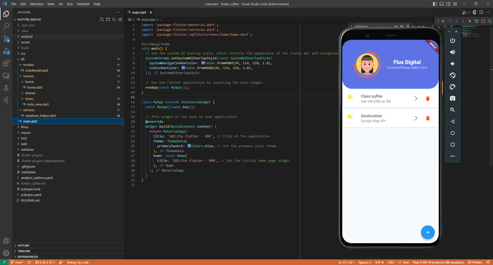

# SQL Database Storage Using Sqlite In Flutter

Build an app whose data is stored in local storage.

In this tutorial, Flutter developers will learn to create a local data storage app using SQLite. SQLite is a self-contained relational database system. Unlike client-server databases, it's embedded within an app. We'll use the sqflite package to integrate SQLite into our Flutter app, offering methods for data operations. It's important to note that all operations in this package are asynchronous.

#### Language

Implementation in Dart

#### Plugins and others

| Plugins       | Source                                 |
| ------------- | -------------------------------------- |
| sqflite       | https://pub.dev/packages/sqflite       |
| path          | https://pub.dev/packages/path          |
| path_provider | https://pub.dev/packages/path_provider |

#### Demo

---
<h1 align='center'>
🚀 About Me
</h1>

<h2 align='center'>
  Hi there 👋 I'm Hemant 👨‍💻
</h2>

  A full-stack developer from Mauritius.

  

  
  &nbsp;&nbsp;
  &nbsp;&nbsp;
  &nbsp;&nbsp;  
  &nbsp;&nbsp;  

  

  Do you like my open source projects? <a href='https://stars.github.com/nominate/'>Nominate me to Github Stars ⭐</a>

  📫 How to reach me: <a href='mailto:hemantramphul@gmail.com'>hemantramphul@gmail.com</a>

